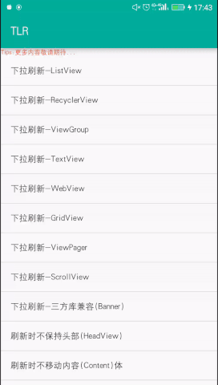
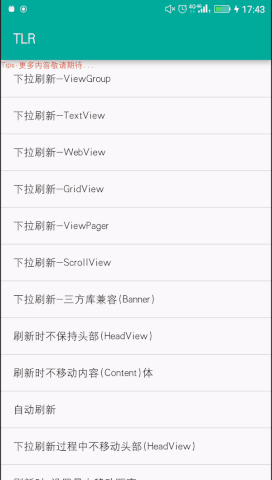
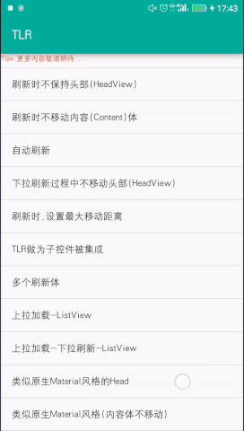

# TLRLoadRefresh

TLRLoadRefresh是一个支持ListView,RecycleView,ViewGroup等下拉刷新和上拉加载的UI组件,使用具有很大的灵活性。可以根据自己的不同需求来定义不同UI设计，可以灵活的自定义下拉刷新的Head和上拉加载的Foot，下面将介绍该控件的使用方法和设计思想，首先先看下效果。

   

# 控件属性介绍

下面对控件的属性坐下介绍，如果描述有不清楚的地方，大家可以自行运行demo查看，demo中也用到我自己写的一个缓存框架，[TCache](https://github.com/borneywpf/TCache)，也欢迎大家star。

## TLRLinearLayout属性介绍,如下：

```xml
    <declare-styleable name="TLRLinearLayout">
        <attr name="enableRefresh" format="boolean"/>
        <attr name="enableLoad" format="boolean"/>
        <attr name="refreshThreshold" format="float"/>
        <attr name="loadThreshold" format="float"/>
        <attr name="refreshMaxMoveDistance" format="dimension"/>
        <attr name="loadMaxMoveDistance" format="dimension"/>
        <attr name="closeAnimDuration" format="integer"/>
        <attr name="openAnimDuration" format="integer"/>
        <attr name="resistance" format="float"/>
        <attr name="releaseRefresh" format="boolean"/>
        <attr name="releaseLoad" format="boolean"/>
        <attr name="keepHeadRefreshing" format="boolean"/>
        <attr name="keepFootLoading" format="boolean"/>
        <attr name="keepContentLayout" format="boolean"/>
        <attr name="canMoveHeadByTLR" format="boolean"/>
        <attr name="canMoveFootByTLR" format="boolean"/>
    </declare-styleable>
```
- **enableRefresh** 是否可以刷新
- **enableLoad** 是否可以加载
- **refreshThreshold** 可刷新系数，以Head View的高度为基础，默认是1.0f
- **loadThreshold** 可加载系数，以Foot View的高度为基础，默认是1.0f
- **refreshMaxMoveDistance** 刷新时，可下拉的最大高度，这个必须要大于加载系数计算的加载高度，否则无法触发刷新
- **loadMaxMoveDistance** 加载时，可上拉的最大高度，同上
- **closeAnimDuration** 刷新结束的动画时间
- **openAnimDuration** 自动刷新，打开Head的动画时间
- **resistance** 触摸滑动阻尼系数，系数越大，触摸滑动的越吃力
- **releaseRefresh** 是否释放刷新，默认是
- **releaseLoad** 是否释放加载，默认是
- **keepHeadRefreshing** 刷新时，是否保持Head View
- **keepFootLoading** 加载时，是否保持Foot View
- **keepContentLayout** 加载或刷新时，是否保持内容体部移动
- **canMoveHeadByTLR** 刷新时，是否可以让Head View一起移动
- **canMoveFootByTLR** 加载时，是否可以让Foot View一起移动

## TLRLinearLayout子控件label设置
```xml
    <declare-styleable name="TLRLinearLayout_Layout">
        <attr name="label" format="enum"> 
            <enum name="head" value="1"/><!--标记view是刷新的head-->
            <enum name="content" value="2"/><!--标记为可刷新体，TLRLinearLayout可以有多个刷新体，可以查看demo-->
            <enum name="foot" value="3"/><!--标记view是加载的foot-->
        </attr>
    </declare-styleable>
```

# TLRLinearLayout子类TLRNestedLinearLayout

TLRNestedLinearLayout子类是支持android的嵌套滑动，可以支持RecycleView,NestedScrollView等嵌套滑动view的下拉刷新和上拉加载，具体可以查看demo

# 实现原理介绍

暂略

# 总结

在实现过程中我参考了一些优秀的开源库，感谢这些无私的大牛们做出的贡献；这个库目前没有进一步封装，因为我还没有做过全面的测试，所以如果有问题欢迎大家指正，并提[issues](https://github.com/borneywpf/TLRLoadRefresh/issues)
  
